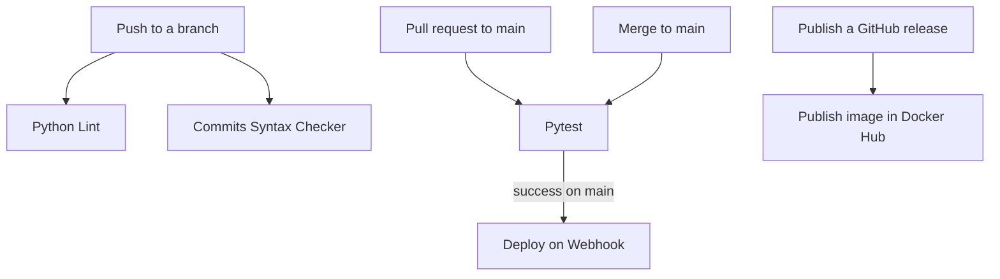

# CI/CD

Understanding the CI/CD pipeline of , implemented using GitHub Actions, is essential for ensuring the seamless and efficient deployment of our application. CI/CD automates the process of testing, building, and deploying code changes, significantly reducing the risk of human error and increasing the speed of development cycles. By mastering the CI/CD setup, you can contribute to a more robust, reliable, and scalable application, ensuring that every code change is integrated smoothly and deployed swiftly.
{: .fs-6 .fw-300 }

## The workflows

All workflows live in `.github/workflows/`. Continuous integration files are prefixed `CI_`, continuous deployment files are prefixed `CD_`.

| File | Workflow name | Runs when | Documented in |
|:---|:---|:---|:---|
| `CI_pytest.yml` | `Pytest` | Push and pull request to `main` | [Testing workflow]({{site.baseurl}}/ci_cd/continuous_integration/testing_workflow) |
| `CI_lint.yml` | `Python Lint` | Every push and pull request | [Linter workflow]({{site.baseurl}}/ci_cd/continuous_integration/linter_workflow) |
| `CI_commits.yml` | `Commits Syntax Checker` | Every push and pull request | [Commit syntax checker workflow]({{site.baseurl}}/ci_cd/continuous_integration/commit_syntax_checker_workflow) |
| `CD_dockerhub.yml` | `Publish image in Docker Hub` | A GitHub release is published | [Docker Hub workflow]({{site.baseurl}}/ci_cd/continuous_deployment/dockerhub_workflow) |
| `CD_webhook.yml` | `Deploy on Webhook` | The `Pytest` workflow succeeds on `main` | [Webhook workflow]({{site.baseurl}}/ci_cd/continuous_deployment/webhook_workflow) |

Every job in every workflow pins its runner to `ubuntu-24.04` and, where Python is needed, to Python 3.13.

## How they fit together

On a branch, two workflows run on every push: the linter and the commit message checker. They are deliberately cheap and unfiltered, so style and commit history problems surface before review.

Once a pull request targets `main`, the `Pytest` workflow joins them, starting a MariaDB service container and running the test suite.

Deployment is chained, not triggered directly. `CD_webhook.yml` listens for the `Pytest` workflow to complete and only acts when the conclusion was `success` and the ref is `refs/heads/main`. Publishing an image to Docker Hub is a separate path, driven by publishing a GitHub release rather than by a merge.

